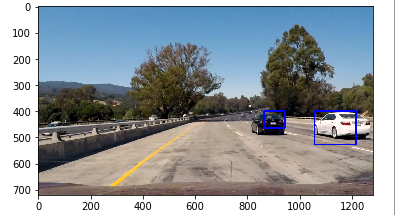
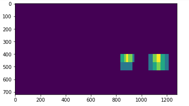
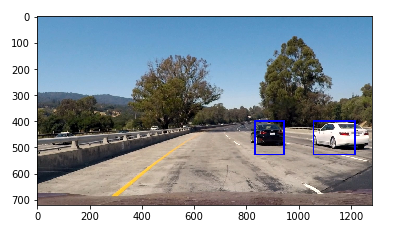

# Vehicle Detection Project

The goals / steps of this project are the following:

* Perform a Histogram of Oriented Gradients (HOG) feature extraction on a labeled training set of images and train a classifier Linear SVM classifier
* Optionally, you can also apply a color transform and append binned color features, as well as histograms of color, to your HOG feature vector. 
* Note: for those first two steps don't forget to normalize your features and randomize a selection for training and testing.
* Implement a sliding-window technique and use your trained classifier to search for vehicles in images.
* Run your pipeline on a video stream (start with the test_video.mp4 and later implement on full project_video.mp4) and create a heat map of recurring detections frame by frame to reject outliers and follow detected vehicles.
* Estimate a bounding box for vehicles detected.

## [Rubric](https://review.udacity.com/#!/rubrics/513/view) Points
Here I will consider the rubric points individually and describe how I addressed each point in my implementation.  

---
### Writeup / README

#### 1. Provide a Writeup / README that includes all the rubric points and how you addressed each one.  You can submit your writeup as markdown or pdf.

You're reading it!

The main files are the ipython notebook, assignment.ipynb and a file containing modified functions from the lessons called utils.py.

### Histogram of Oriented Gradients (HOG)

#### 1. Explain how (and identify where in your code) you extracted HOG features from the training images.

The code for this step is contained in the eighth code cell of the IPython notebook.

I started by reading in all the `vehicle` and `non-vehicle` images and passing them to `utils.extract_features()` which does all the feature extraction for the training images. HOG features are generated by utils.get_hog_features()

#### 2. Explain how you settled on your final choice of HOG parameters.

I explored color representations like YUV, RGB, HSV, YCrCb and HLS. YUV seemed to have the best result, but it did appear very similar to YCrCb.

Notebook cell 4 has all of the parameters split out and I tried various combinations. A larger number of pixels per cell (16 instead of 8) worked best to reduce false positives.

#### 3. Describe how (and identify where in your code) you trained a classifier using your selected HOG features (and color features if you used them).

I trained a linear SVM using...

### Sliding Window Search

#### 1. Describe how (and identify where in your code) you implemented a sliding window search.  How did you decide what scales to search and how much to overlap windows?

 Reducing the cells_per_step to 1 then allowed for a significant amount of overlap when sliding.  I manually experimented with various scales from 0.5 to 4.0 and using just a scale of 1 and 2 together worked well.

#### 2. Show some examples of test images to demonstrate how your pipeline is working.  What did you do to optimize the performance of your classifier?

Ultimately I searched on two scales using YUV 3-channel HOG features plus spatially binned color and histograms of color in the feature vector, which provided a nice result.  Here are some example images:

To speed up the model processing the video, I turned off stepping in the y direction and limited the number of scales to process to two and still got good results.

---

### Video Implementation

#### 1. Provide a link to your final video output.  Your pipeline should perform reasonably well on the entire project video (somewhat wobbly or unstable bounding boxes are ok as long as you are identifying the vehicles most of the time with minimal false positives.)
Here's a [link to my video result](https://vimeo.com/226683982)

#### 2. Describe how (and identify where in your code) you implemented some kind of filter for false positives and some method for combining overlapping bounding boxes.

I recorded the positions of positive detections in each frame of the video.  From the positive detections I created a heatmap and then thresholded that map to identify vehicle positions.  I then used `scipy.ndimage.measurements.label()` to identify individual blobs in the heatmap.  I then assumed each blob corresponded to a vehicle.  I constructed bounding boxes to cover the area of each blob detected.  

Here's an example result showing the heatmap from a series of frames of video, the result of `scipy.ndimage.measurements.label()` and the bounding boxes then overlaid:

See the HeatMap class in utils.py

---

###Discussion

####1. Briefly discuss any problems / issues you faced in your implementation of this project.  Where will your pipeline likely fail?  What could you do to make it more robust?

There are still too many false positives, yet the SVM gets a score on the test set of 99%. In the future, I'd like to try a better training dataset that would include better negative examples.

Vehicles that are far away or very close would probably not be caught because only 2 medium range scales were selected.

I think the intermittent false positives and negatives could be smoothed out by adding information from previous frames like maybe averaging the last 3 heatmaps or tracking and predicting the centroids of the vehicles across frames.
 

